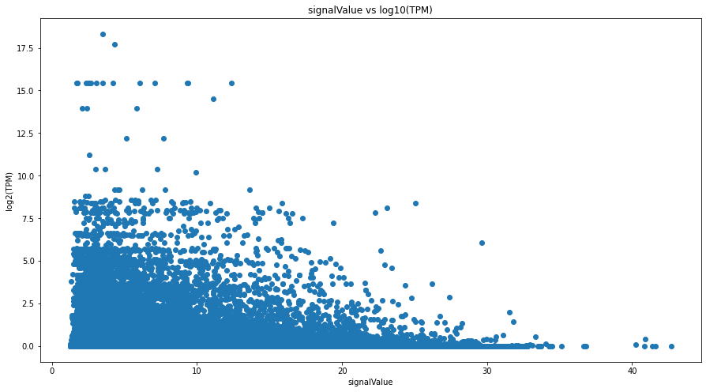
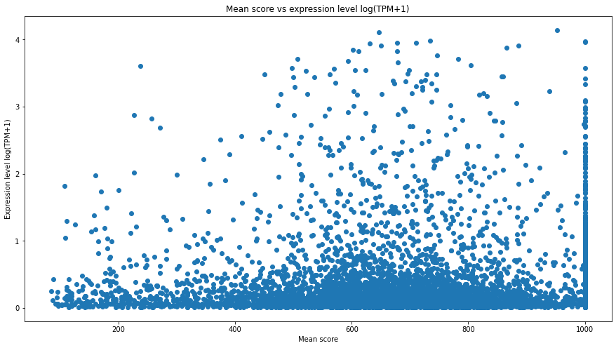

# Integration-of-Adrenal-Gland-ATACseq-and-RNAseq

Integration of ATACseq and RNAseq for Adrenal Gland Tissue data from ENCODE

# Introduction

After getting highly interested in Computational Biology for Gene Therapy, I began with this project. The aim was to integrate the ATACseq and RNAseq data for a particular tissue and see how they correlate.

# Data

The data used came from two experiments and was found from the ENCODE website. The experiment identifiers are as follows:
- ATACseq of Adrenal Gland: https://doi.org/doi:10.17989%2FENCSR553LAZ
- RNAseq of Adrenal Gland: https://doi.org/doi:10.17989%2FENCSR176KEW

# Approach

I wanted to find how gene expresssion related with different parts of the DNA being non-condensed (and the corresponding score, given by the ATACseq analysis). Hence, ideally, I would require both ATACseq and RNAseq data from the same sample. However, in ENCODE (https://www.encodeproject.org/), I couldn't find such data. Hence, I took the two types of data from a tissue (different experiments), but since it was the same tissue (and averaged out over many cells), the correlation would still be there.

I specifically worked on adrenal gland for the sole reason that it was the first tissue entry in ENCODE with noth ATACseq and RNAseq data.

I first found out the nearest genes of each peak identified in the ATACseq bed file. This was done by finding the midpoint for all the genes (set of genes was obtained from Ensembl) and peaks and matching those with minimum distance. Hence, many possible peaks could come from the same gene, but each peak was assumed to be associated with exactly one gene, and that too the one nearest to it. This is a big assumption.

Then, once the gene for each peak was identified, I took the RNAseq data for that gene from the corresponding tsv file (RNAseq experiment mentioned above, for adrenal gland), and mapped it against all the peaks for that gene identified prior (and the scores of those peaks).

Using the ATACseq peak scores and the RNAseq expression values (TPM, Transcripts per million), the correlation between the gene expressions and their regulatory regions' openness was determined.

# Results

Scatter plot of gene_TPM (log) vs peak_signal_value

Scatter plot of avg_peak_signal_value vs gene_TPM (log)

# References

- https://www.encodeproject.org/
- https://useast.ensembl.org/index.html